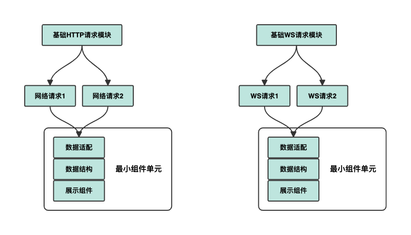

# React微组件设计理念

- 更好得在不同项目之间复用组件
- 不变的组件展示和交互逻辑
- 需要根据不同项目进行修改适配层
- 使用 react hooks 方式对数据适配层的编写
- 最小组件原则

不同于传统的UI组件封装, 对外部数据的进行展示. 该模式是高度集成业务功能的通用组件展示, 在不同项目中需要对相同功能进行开发的情况下. 该模式需要修改数据适配层和重新修改数据接口层, 所以当展示组件的功能编写完成后, 展示层的逻辑代码是持久不变的.
